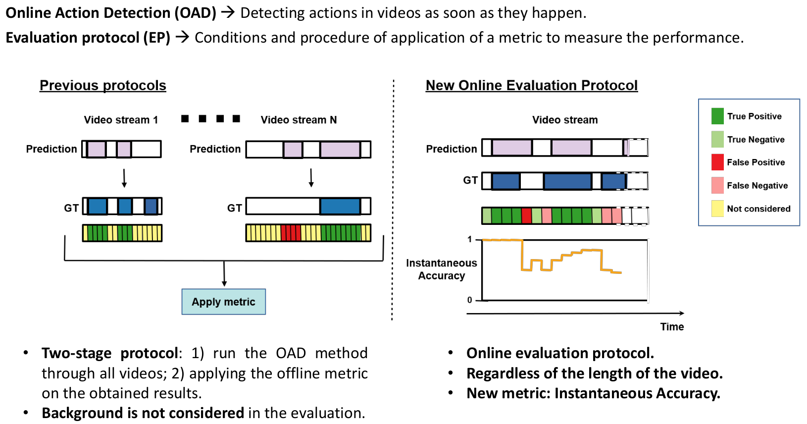

# Instantaneous Accuracy

This repository contains the code of the Instantaneous Accuracy metric. The metric was presented [here](https://arxiv.org/pdf/2003.09970.pdf) and extended [here](https://arxiv.org/pdf/2003.12041.pdf).

<p align="center">
  
</p>


### Citation

If you find anything of this repository useful for your projects, please consider citing these works:

```bibtex
@inproceedings{Baptista2019iccvw,
  Title     = {The Instantaneous Accuracy: a Novel Metric for the Problem of Online Human Behaviour Recognition in Untrimmed Videos},
  Author    = {M. {Baptista R\'ios} and R. J. {L\'opez-Sastre} and F. {Caba-Heilbron} and J. {van Gemert} and F. J. {Acevedo-Rodr\'iguez} and S. {Maldonado-Basc\'on}},
  Booktitle = {IEEE International Conference on Computer Vision Workshop (ICCVW)},
  pages     = {1282-1284},
  Year      = {2019},
  doi       = {10.1109/ICCVW.2019.00162},
  month     = {October}
}
```

```bibtex
@article{Baptista2019ieeea,
	author  = {M. {Baptista R\'ios} and R. J. {L\'opez-Sastre} and F. {Caba Heilbron} and J. C. {Van Gemert} and F. J. {Acevedo-Rodr\'iguez} and S. {Maldonado-Basc\'on}},
	journal = {IEEE Access},
	title   = {Rethinking Online Action Detection in Untrimmed Videos: A Novel Online Evaluation Protocol},
	year	= {2019},
	volume  = {8},
	pages   = {5139-5146},
	doi     = {10.1109/ACCESS.2019.2961789},
	ISSN	= {2169-3536}
}
```

### How to obtain the performance of your model

You can find here how to use the code to obtain the performance of your model with this metric.

###### Ground Truth file

The code of the metric accepts ground truth files with `.json` format following the next structure (based on ActivityNet annotation):

```json
database: {
    video_test_0000006: {
        subset: "Test",
        duration: 67.11,
        annotations: [
            {
                label: "VoleyballSpiking",
                segment: [18.8, 57.3],
            }
        ],
    }
}
```

For Thumos'14 and TVSeries datasets, we have converted their original annotations to this format. We share both of them within this repo: `annotations/gt-thumos14.json` and `annotations/gt-tvseries.json` for Thumos14 and TVSeries respectively. ActivityNet1.3 dataset annotations can be used directly, and they can be downloaded from [here](http://activity-net.org/download.html) or using the following command.

```bash
wget -O annotations/gt-activitynet.json http://ec2-52-25-205-214.us-west-2.compute.amazonaws.com/files/activity_net.v1-3.min.json
```

###### Prediction file

The code of the metric accepts result files with `.json` format following the next structure:

```json
results: {
    video_test_0000006: [
        {
            segment: [22.3, 47.8]
            label: "VoleyballSpiking",
        }
    ]
}
```

###### Usage

*(The code has been tested using Python 3, specifically we have used python 3.7. It should run with any Python 3.X distribution, though we recommend to use the same version as us. Additionally, the python installation requires*`Numpy` *and* `Pickle` *packages.)*

Once you have the results of your method in the correct format, just change current directory to the `source/` and run the  next command to obtain its performance:

```bash
python compute_instantaneous_accuracy.py -d Thumos14 -gt ../annotations/gt-thumos14.json -subset Test -pred ../data/c3d-thumos14.json -pkl ./c3d-thumos14-ia.pkl

```

Where the options are:

- `-d`: name of the dataset.
- `-gt`: path to a `.json` ground truth file with the correct structure.
- `-subset`: subset of the dataset which you are evaluating your method on. In our experiments, we use the following subsets during the evaluation (please specify them exactly as we spell them):
  - `Test` for Thumos'14.
  - `Test` for TVSeries.
  - `validation` for ActivityNet1.3.
- `-pred`: path to a `.json` prediction file with the correct structure.
- `-pkl`: path file where the `.pkl` generated file will be stored.

After running the command, the script will prompt the **weighted mean average Instantaneous Accuracy (maIA), which is the default version of the metric** (more details can be found in the publications). But in the `.pkl` file generated at the end of the execution, you can see the non-weighted version (mean average Instantaneous Accuracy w/o weighting) as well as the Instantaneous Accuracy for each analysed video.

### Results

We have conducted several experiments with some baselines and other available state-of-the-art model. You can find more information in the publications. However, as an example, we give the `.json` files with the results on Thumos'14, TVSeries and ActivityNet1.3 datasets of our 3D-CNN baseline based on the C3D network. These files are stored in the `data/` directory.

In the next table, we also show the default maIA (weighted version) performance of the 3D-CNN baseline model for the all datasets in the next table:

|                       | Thumos'14 | TVSeries | ActivityNet1.3 |
| --------------------- | --------- | -------- | -------------- |
| **weighted maIA (%)** | 58.10     | 28.95    | 27.38          |

